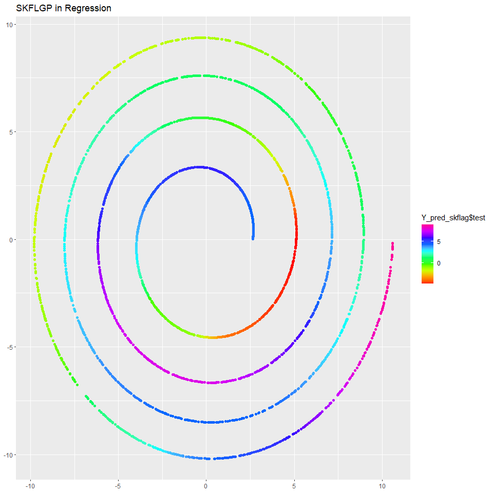

<!-- README.md is generated from README.Rmd. Please edit that file -->

# FLGP

<!-- badges: start -->
<!-- badges: end -->

The objective of FLGP is to provide algorithms to make fast inference in
the large scale data by heat kernel GPs, which utilize the intrinsic
manifold geometry. The fast computation benefits from subsampling,
constructing a reduced-rank approximation of the similarity matrix and
truncated SVD. More details refer to the original paper. The package
consists of Gaussian process classification (GPC) and Gaussian process
regression (GPR) algorithms.

## Installation

You can install the development version of FLGP from
[GitHub](https://github.com/) with:

``` r
# install.packages("devtools")
devtools::install_github("junhuihe2000/FLGP")
```

## Example

These are some basic examples which show you how to solve classification
and regression problems with FLGP:

### Gaussian process classification(GPC)

``` r
library(ggplot2)
library(FLGP)
## basic example code

set.seed(1234)
```

``` r
## generate samples
n = 4800; n_each = 800; d = 3
thetas = runif(n, 0, 2*pi)
X = matrix(0, nrow=n, ncol=2); Y = matrix(0, nrow=n, ncol=1)
X[,1] = cos(thetas); X[,2] = sin(thetas)
for(i in 0:5) {
  X[(i*n_each+1):((i+1)*n_each),] = (0.5+0.1*i)*X[(i*n_each+1):((i+1)*n_each),]
  Y[(i*n_each+1):((i+1)*n_each),] = as.numeric((-1)^i>0)
}

## process data
X = scale(X, center = TRUE, scale = TRUE)
X = X / sqrt(ncol(X))

## divide the training set and the testing set
m = 100
train.index = sample.int(n, m); test.index = c(1:n)[-train.index]
train.data = X[train.index,]; test.data = X[test.index,]
train.label = Y[train.index,]; test.label = Y[test.index,]


## plot
ggplot() + geom_point(aes(X[,1],X[,2],color=factor(Y)), size=0.6, alpha=0.6) +
  scale_color_manual(values = c("red", "orange")) + 
  theme(legend.position="none", 
        axis.title.x=element_blank(), axis.title.y=element_blank()) +
  ggtitle("Classification")
```


``` r
## FLGP

## set hyper-parameters
s = 600; r = 3; K = 100
models = list(subsample="kmeans", kernel="lae", gl="cluster-normalized", root=TRUE)
```

``` r
## FLGP with the square exponential kernel and k-means subsampling
cat("SKFLGP:\n")
#> SKFLGP:
t1 = Sys.time()
res_skflag.torus = fit_se_logit_gp_rcpp(train.data, train.label, test.data, s, r, K, models = models)
y_skflag.torus = res_skflag.torus$Y_pred
t2 = Sys.time()
print(t2-t1)
#> Time difference of 20.95316 secs
err_skflag.torus = sum((test.label!=y_skflag.torus$test)^2)/(n-m)
cat("The error rate of SKFLGP is",err_skflag.torus,".\n")
#> The error rate of SKFLGP is 0 .
```

``` r
## FLGP with local anchor embedding and k-means subsampling
cat("LKFLGP:\n")
#> LKFLGP:
t3 = Sys.time()
res_lkflag.torus = fit_lae_logit_gp_rcpp(train.data, train.label, test.data, s, r, K, models = models)
y_lkflag.torus = res_lkflag.torus$Y_pred
t4 = Sys.time()
print(t4-t3)
#> Time difference of 3.973193 secs
err_lkflag.torus = sum((test.label-y_lkflag.torus$test)^2)/(n-m)
cat("The error rate of LKFLGP is",err_lkflag.torus,".\n")
#> The error rate of LKFLGP is 0.02702128 .
```

### Gaussian process regression(GPR)

``` r
set.seed(1234)
n = 4000
theta = runif(n,0,8*pi)
X = cbind((theta+4)^(0.7)*cos(theta), (theta+4)^(0.7)*sin(theta))
Y = 3*sin(theta/10) + 3*cos(theta/2) + 4*sin(4*theta/5)

ggplot() + geom_point(aes(X[,1],X[,2],color=Y)) +
  scale_color_gradientn(colours = rainbow(10)) +
  theme(axis.title.x=element_blank(), axis.title.y=element_blank()) +
  ggtitle("Regression")
```


``` r
m = 200
train.index = sample.int(n,m); test.index = c(1:n)[-train.index]
X.train = X[train.index,]; Y.train = Y[train.index]
Y.train = Y.train + rnorm(m,0,1)
X.test = X[test.index,]; Y.test = Y[test.index]
```

``` r
s = 500; r = 3; K = 100
```

``` r
res_pred_skflag = fit_se_regression_gp_rcpp(X.train,Y.train,X.test,s,r,K,models=models)
Y_pred_skflag = res_pred_skflag$Y_pred
```

``` r
rmse_skflag.spiral = sqrt(sum((Y.test-Y_pred_skflag$test)^2)/(n-m))
cat("The RMSE of SKFLGP is",rmse_skflag.spiral,".\n")
#> The RMSE of SKFLGP is 0.5032034 .
```

``` r
ggplot() + geom_point(aes(X.test[,1],X.test[,2],color=Y_pred_skflag$test)) +
  scale_color_gradientn(colours = rainbow(10)) +
  theme(axis.title.x=element_blank(), axis.title.y=element_blank()) +
  ggtitle("SKFLGP in Regression")
```



``` r
res_pred_lkflag = fit_lae_regression_gp_rcpp(X.train,Y.train,X.test,s,r,K,models=models)
Y_pred_lkflag = res_pred_lkflag$Y_pred
```

``` r
rmse_lkflag.spiral = sqrt(sum((Y.test-Y_pred_lkflag$test)^2)/(n-m))
cat("The RMSE of LKFLGP is",rmse_lkflag.spiral,".\n")
#> The RMSE of LKFLGP is 0.4582096 .
```

``` r
ggplot() + geom_point(aes(X.test[,1],X.test[,2],color=Y_pred_lkflag$test)) +
  scale_color_gradientn(colours = rainbow(10)) +
  theme(axis.title.x=element_blank(), axis.title.y=element_blank()) +
  ggtitle("LKFLGP in Regression")
```


